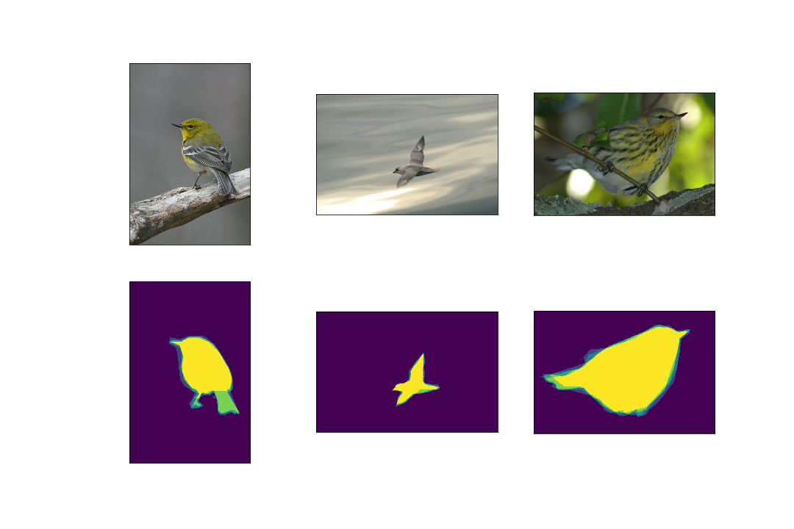

# ProjectDL2-Segmentation

The goal of this project is performing a segmentation task on a set of images. The experiments are performed on the [Caltech-UCSD Birds 200](http://www.vision.caltech.edu/visipedia/CUB-200.html) dataset. The task for this dataset is identifying birds of different species.
