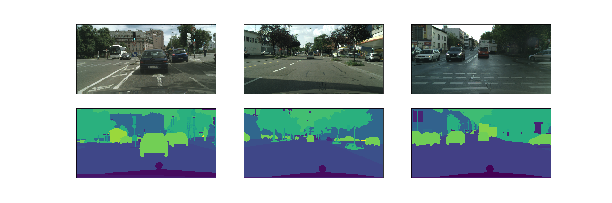

# ProjectDL2-Segmentation

The goal of this project is performing a segmentation task on a set of images. The experiments are performed on the [Cityscapes](https://www.cityscapes-dataset.com/) dataset, on the subset with fine annotations. The dataset consists of pictures taken on the streets of European cities, the goal being semantic segmentation of presented scenes.
