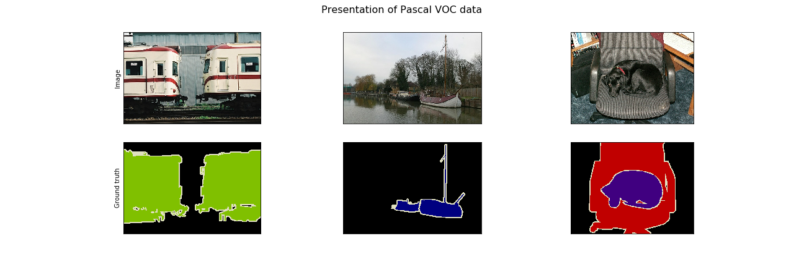

# ProjectDL2-Segmentation
## About
The goal of this project is semantic segmentation of images. The experiments are performed on the [Pascal VOC](http://host.robots.ox.ac.uk/pascal/VOC/) dataset.

The project uses custom training, validation and test splits of the `trainval` subset of the dataset.

## Usage
### Training
To train a model run
```shell script
python train.py --config [path to configuration file]
```
Optional arguments:
* `--save-checkpoint [path]` to specify a location to save model parameters after training. If not provided model parameters will not be saved
* `--load-checkpoint [path]` to specify model parameters to load. If not provided model will be initialized with random parameters
* `--data-dir [path]` to specify the location of the data. The default value is `./data`.

All options can also be specified in the configuration file.

### Evaluation
To evaluate a model on the test dataset run
```shell script
python evaluate.py --config [path to configuration file] --load-checkpoint [path to model parameters]
```
Optional arguments:
* `--data-dir [path]` to specify the location of the data. The default value is `./data`.

### Downloading data
A script to download image data is provided. To use it run
```shell script
scripts/download.sh [path]
```
The default value of the `path` parameter is `./data`. Data will be extracted to `path/VOCdevkit`.
